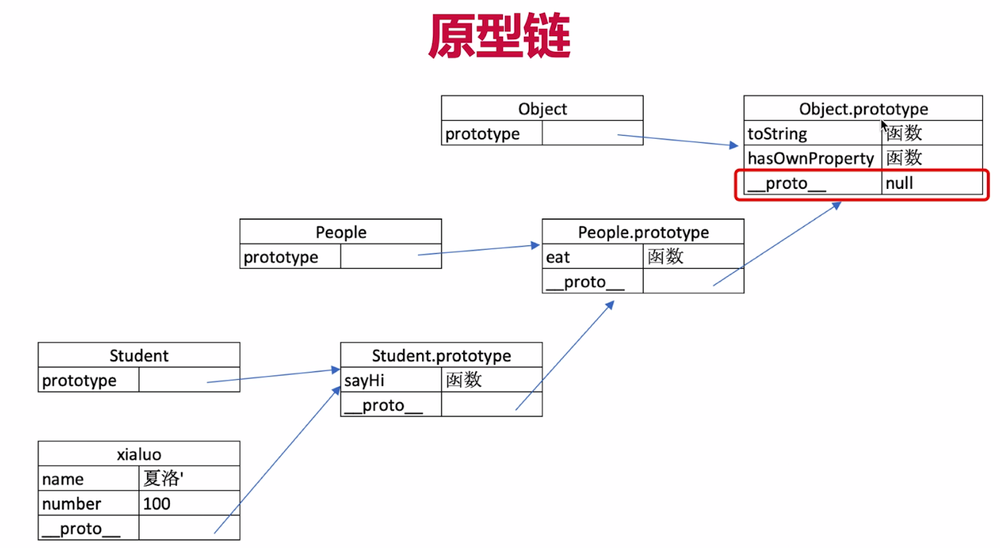
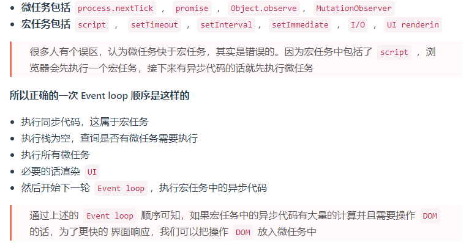

# js基础
### 变量类型
#### 1、值类型
- 基本类型：String、Number、null、undefined、Boolean、symbol。数据占用空间小，存储在栈中
- 引用类型：object，数据存储在堆中，地址存储在栈中，指向这个对象
- JS基本数据类型的变量存放的是基本类型数据的实际值；而引用数据类型的变量保存对它的引用，即指针
#### 2、typeof运算符
- 识别所有值类型
- 识别函数
- 识别是否是引用类型（无法细分，使用instanceof）

#### 3、手写深拷贝
```js
/**
 * 深拷贝
 * @param {Object} obj 要拷贝的对象
 */
function deepClone (obj = {}) {
  if (typeof obj !== 'object' || obj == null) {
    // obj 是 null ，或者不是对象和数组，直接返回
    return obj
  }

  // 初始化返回结果
  let result
  if (obj instanceof Array) {
    result = []
  } else {
    result = {}
  }

  for (let key in obj) {
    // 保证 key 不是原型的属性
    if (obj.hasOwnProperty(key)) {
      // 递归调用！！！
      result[key] = deepClone(obj[key])
    }
  }

  // 返回结果
  return result
}
```
> 这个问题通常可以通过 JSON.parse(JSON.stringify(obj)) 来解决  
> 但是该方法也是有局限性的：
> - 会忽略 undefined
> - 会忽略 symbol
> - 不能序列化函数
> - 不能解决循环引用的对象

### 变量计算-类型转换
- 字符串拼接
- ==（建议使用全等===）
- if语句及逻辑运算 (truly: !!a===true; falsely: !!a===false)
---

# 原型和原型链（重点）

### 1、class类
参考es6

#### 继承
- extends
- super
- 扩展或重写方法
  
### 2、instanceof 类型判断
内部机制是通过判断对象的原型链中是不是能找到类型的 prototype
```js
function instanceof(left, right) {
    // 获得类型的原型
    let prototype = right.prototype
    // 获得对象的原型
    left = left.__proto__
    // 判断对象的类型是否等于类型的原型
    while (true) {
    	if (left === null)
    		return false
    	if (prototype === left)
    		return true
    	left = left.__proto__
    }
}
```

### 3、原型
- class 实际上是函数，是语法糖
- 每个class都有显示原型prototype
- 每个实例都有隐式原型__proto__
- 实例的__proto__指向对应class的prototype
  
### 4、原型链(能画)


---

### 思考
#### 1、如何准确判断一个变量是数组
- arr instanceof Array
- Array.isArray(arr)
- Object.prototype.toString.call(arr).slice(8,-1)

#### 2、class的原型本质
- 原型和原型链图示
- 属性和方法的执行规则（顺着原型链一步步查找）
  
#### 3、手写建议jQuery，考虑插件和扩展性
```js
class jQuery {
    constructor(selector) {
        const result = document.querySelectorAll(selector)
        const length = result.length
        for (let i = 0; i < length; i++) {
            this[i] = result[i]
        }
        this.length = length
        this.selector = selector
    }
    get(index) {
        return this[index]
    }
    each(fn) {
        for (let i = 0; i < this.length; i++) {
            const elem = this[i]
            fn(elem)
        }
    }
    on(type, fn) {
        return this.each(elem => {
            elem.addEventListener(type, fn, false)
        })
    }
    // 扩展很多 DOM API
}

// 插件
jQuery.prototype.dialog = function (info) {
    alert(info)
}

// "造轮子"
class myJQuery extends jQuery {
    constructor(selector) {
        super(selector)
    }
    // 扩展自己的方法
    addClass(className) {

    }
    style(data) {
        
    }
}

// const $p = new jQuery('p')
// $p.get(1)
// $p.each((elem) => console.log(elem.nodeName))
// $p.on('click', () => alert('clicked'))


```

# 作用域和闭包（重要）
作用域：变量能够合法使用的范围
- 全局作用域
- 函数作用域
- 块级作用域

作用域链: 
- 变量的查找从当前作用域开始，如果找到即停止，没有找到则继续向上级作用域查找,直到全局作用域或找到为止

闭包
- 有权访问另一个函数作用域中变量的函数，创建闭包的最常见的方式就是在一个函数内创建另一个函数，通过另一个函数访问这个函数的局部变量，利用闭包可以突破作用链域

闭包的特性：
- 函数内再嵌套函数
- 内部函数可以引用外层的参数和变量
- 参数和变量不会被垃圾回收机制回收

两种表现：
- 函数作为参数被传递
- 函数作为返回值被返回
```js
// 函数作为返回值
// function create() {
//     const a = 100
//     return function () {
//         console.log(a)
//     }
// }

// const fn = create()
// const a = 200
// fn() // 100

// 函数作为参数被传递
function print (fn) {
  const a = 200
  fn()
}
const a = 100
function fn () {
  console.log(a)
}
print(fn) // 100

// 所有的自由变量的查找，是在函数定义的地方，向上级作用域查找
// 不是在执行的地方！！！
```

### 1、this的应用场景，如何取值
[this传送门](https://blog.csdn.net/weixin_37722222/article/details/81625826)
- 作为普通函数 => window
- 使用call apply bind => 绑定的值
- 做为对象函数被调用 => 对象本身
```js
let obj = {
  a: 222,
  fn: function () {
    setTimeout(function () { console.log(this) })
  }
};
obj.fn(); // window

let obj2 = {
  a: 222,
  fn: function () {
    setTimeout(() => { console.log(this) });
  }
};
obj2.fn(); // obj
```
- 在class方法中调用 => 实例
- 箭头函数 => 上级作用域中的this

**this取值是在函数执行时确认，而不是在定义时执行**

### 2、手写bind、call及apply函数
```js
function fn (a, b) {
  console.log(this);
  console.log({ a, b });
}
// 模拟bind
Function.prototype.myBind = function () {
  // context 即为this
  const [context, ...args] = Array.from(arguments)
  // fn.bind(...)中的fn
  const self = this
  // 返回一个函数
  return function () {
    return self.apply(context, args)
  }
}

const fn3 = fn.myBind({ x: 2 }, 3, 4)
fn3() // {x:2} {a:3, b:4}
```
```js
// 模拟call
Function.prototype.myCall = function (context) {
  var context = context || window
  // 给 context 添加一个属性
  // getValue.call(a, 'yck', '24') => a.fn = getValue
  context.fn = this
  // 将 context 后面的参数取出来
  var args = [...arguments].slice(1)
  // getValue.call(a, 'yck', '24') => a.fn('yck', '24')
  var result = context.fn(...args)
  // 删除 fn
  delete context.fn
  return result
}
```
```js
Function.prototype.myApply = function (context) {
  var context = context || window
  context.fn = this
  var result
  // 需要判断是否存储第二个参数
  // 如果存在，就将第二个参数展开
  if (arguments[1]) {
    result = context.fn(...arguments[1])
  } else {
    result = context.fn()
  }
  delete context.fn
  return result
}
```

### 3、实际开发中闭包的应用场景
- 闭包的最大用处有两个，一个是可以读取函数内部的变量，另一个就是让这些变量始终保持在内存中
- 闭包的另一个用处，是封装对象的私有属性和私有方法
  
**案例：隐藏数据**
```js
// 闭包隐藏数据，只提供 API
function createCache () {
  const data = {} // 闭包中的数据，被隐藏，不被外界访问
  return {
    set: function (key, val) {
      data[key] = val
    },
    get: function (key) {
      return data[key]
    }
  }
}

const c = createCache()
c.set('a', 100)
console.log(c.get('a'))
```
**案例：做一个简单的cache工具**
- 如：节流防抖

**使用闭包的注意点**
- 由于闭包会使得函数中的变量都被保存在内存中，内存消耗很大，所以不能滥用闭包，否则会造成网页的性能问题，在IE中可能导致内存泄露
- 解决方法是，在退出函数之前，将不使用的局部变量全部删除

---

# 异步与单线程（重要）
- 单线程与异步
   - js是单线程语言，只能同时做一件事
   - 浏览器和nodejs已支持js启动进程，如Web Worker
   - js和DOM渲染共用同一线程，因为js可以修改DOM结构
   - 遇到等待，不能卡住，所以需要异步（不阻塞代码执行）
- es6前：callback hell
- es6+：promise、generator、async/await

## 思考
### 1、同步与异步的区别
基于js是单线程本质，异步不会阻塞代码执行，同步会阻塞

### 2、手写promise加载一张图片
```
function loadImg (src) {
  const p = new Promise(
    (resolve, reject) => {
      const img = document.createElement('img')
      img.onload = () => {
        resolve(img)
      }
      img.onerror = () => {
        const err = new Error(`图片加载失败 ${src}`)
        reject(err)
      }
      img.src = src
    }
  )
  return p
}
```

### 3、前端使用异步的应用场景
- 网络请求，如ajax请求
- 定时任务，如setTimeout、setInterval

---

# js异步-进阶(重要)
- event loop
- promise 进阶
- async/await
- 微任务/宏任务

### 思考题:
- 请描述event loop（事件循环/事件轮询）的机制，可画图
- 什么是宏任务和微任务，两者有什么区别
- promise有哪三种状态，如何变化
- 场景题：promise then 和catch的连接
- async/await 语法
- promise和setTimeout的顺序
- 外加async/await的顺序问题


**event loop（事件循环/事件轮询）**
- js是单线程运行的
> 如果 JS 是门多线程的语言话，我们在多个线程中处理 DOM 就可能会发生问题（一个线程中新加节点，另一个线程中删除节点）。
- 异步是基于回调来实现的
- DOM事件（不是异步，只是都基于事件循环）也是使用回调，也是基于event loop
- event loop 就是异步回调的实现原理

**总结event loop过程**
- 同步代码，一行一行放在Call Stack执行
- 遇到异步，会先"记录"下来，等待时机（网络请求、定时器等）
- 时机到了，就移动到Callback Queue
- 如果Call Stack为空（同步代码执行完毕），Event loop 开始工作
- 轮询查找Callback Queue，如有则移动到Call Stack执行
- 然后继续轮询查找（类似死循环一样）
> 本质上来说 JS 中的异步还是同步行为



**promise**
- 三种状态
   - pending 
   - resolved
   - rejected
- pending=>resolved或者pending=>rejected，结果不可逆
- pending状态，不会触发then和catch
- resolved状态，触发后续then回调函数
- rejected状态，触发后续catch回调函数

**then 和catch改变状态(重要)**
- then正常返回resolved，里面有报错则返回rejected
- catch正常返回resolved，里面有报错则返回rejected 
```js
// 第一题
Promise.resolve().then(() => {
    console.log(1) // 1
}).catch(() => {
    console.log(2)
}).then(() => {
    console.log(3) // 3
})

// 第二题
Promise.resolve().then(() => { // 返回 rejected 状态的 promise
    console.log(1) // 1
    throw new Error('erro1')
}).catch(() => { // 返回 resolved 状态的 promise
    console.log(2) // 2
}).then(() => {
    console.log(3) // 3
})

// 第三题
Promise.resolve().then(() => { // 返回 rejected 状态的 promise
    console.log(1) // 1
    throw new Error('erro1')
}).catch(() => { // 返回 resolved 状态的 promise
    console.log(2) // 2
}).catch(() => {
    console.log(3)
})
```

# async/await

- 语法介绍
- 和 Promise 的关系
- 异步本质
- for...of

**有很多 async 的面试题，例如** 
- async 直接返回，是什么
- async 直接返回 promise
- await 后面不加 promise

## 语法介绍

用同步的方式，编写异步

```js
function loadImg(src) {
    const promise = new Promise((resolve, reject) => {
        const img = document.createElement('img')
        img.onload = () => {
            resolve(img)
        }
        img.onerror = () => {
            reject(new Error(`图片加载失败 ${src}`))
        }
        img.src = src
    })
    return promise
}

async function loadImg1() {
    const src1 = 'http://www.imooc.com/static/img/index/logo_new.png'
    const img1 = await loadImg(src1)
    return img1
}

async function loadImg2() {
    const src2 = 'https://avatars3.githubusercontent.com/u/9583120'
    const img2 = await loadImg(src2)
    return img2
}

(async function () {
    // 注意：await 必须放在 async 函数中，否则会报错
    try {
        // 加载第一张图片
        const img1 = await loadImg1()
        console.log(img1)
        // 加载第二张图片
        const img2 = await loadImg2()
        console.log(img2)
    } catch (ex) {
        console.error(ex)
    }
})()
```

## 和 Promise 的关系(重要)

- async 函数返回结果都是 Promise 对象（如果函数内没返回 Promise ，则自动封装一下）

```js
async function fn2() {
    return new Promise(() => {})
}
console.log( fn2() )

async function fn1() {
    return 100
}
console.log( fn1() ) // 相当于 Promise.resolve(100)
```

- await 后面跟 Promise 对象：会阻断后续代码，等待状态变为 resolved ，才获取结果并继续执行
- await 后续跟非 Promise 对象：会直接返回

```js
(async function () {
    const p1 = new Promise(() => {})
    await p1
    console.log('p1') // 不会执行
})()

(async function () {
    const p2 = Promise.resolve(100)
    const res = await p2
    console.log(res) // 100
})()

(async function () {
    const res = await 100
    console.log(res) // 100
})()

(async function () {
    const p3 = Promise.reject('some err')
    const res = await p3
    console.log(res) // 不会执行
})()
```

- try...catch 捕获 rejected 状态

```js
(async function () {
    const p4 = Promise.reject('some err')
    try {
        const res = await p4
        console.log(res)
    } catch (ex) {
        console.error(ex)
    }
})()
```

总结来看：

- async 封装 Promise
- await 处理 Promise 成功（相当于Promise.then）
- try...catch 处理 Promise 失败

## 异步本质

await 是同步写法，但本质还是异步调用。

```js
async function async1 () {
  console.log('async1 start')
  await async2()
  // await 后面的代码都可以看做是回调中的内容，即异步
  console.log('async1 end') // 关键在这一步，它相当于放在 callback 中，最后执行
}

async function async2 () {
  console.log('async2')
}

console.log('script start')
async1()
console.log('script end')

// script start
// async1 start
// async2
// script end
// async1 end
```

即，只要遇到了 `await` ，后面的代码都相当于放在 callback 里。

## for...of

```js
// 定时算乘法
function multi(num) {
    return new Promise((resolve) => {
        setTimeout(() => {
            resolve(num * num) 
        }, 1000)
    })
}

// // 使用 forEach ，是 1s 之后打印出所有结果，即 3 个值是一起被计算出来的
// function test1 () {
//     const nums = [1, 2, 3];
//     nums.forEach(async x => {
//         const res = await multi(x);
//         console.log(res);
//     })
// }
// test1();

// 使用 for...of ，可以让计算挨个串行执行
async function test2 () {
    const nums = [1, 2, 3];
    for (let x of nums) {
        // 在 for...of 循环体的内部，遇到 await 会挨个串行计算
        const res = await multi(x)
        console.log(res)
    }
}
test2()
```
---

# 宏任务和微任务

- 宏任务：setTimeout setInterval DOM 事件 AJAX
- 微任务：Promise（对于前端来说）
- 微任务比宏任务执行的更早（在不考虑script宏任务的前提下，参考上述思考题）

```js
console.log(100)
setTimeout(() => {
    console.log(200)
})
Promise.resolve().then(() => {
    console.log(300)
})
console.log(400)
// 100 400 300 200
```

## event loop 和 DOM 渲染

再次回顾 event loop 的过程

- 每一次 call stack 结束，都会触发 DOM 渲染（不一定非得渲染，就是给一次 DOM 渲染的机会！！！）
- 然后再进行 event loop

```js
const $p1 = $('<p>一段文字</p>')
const $p2 = $('<p>一段文字</p>')
const $p3 = $('<p>一段文字</p>')
$('#container')
            .append($p1)
            .append($p2)
            .append($p3)

console.log('length',  $('#container').children().length )
alert('本次 call stack 结束，DOM 结构已更新，但尚未触发渲染')
// （alert 会阻断 js 执行，也会阻断 DOM 渲染，便于查看效果）
// 到此，即本次 call stack 结束后（同步任务都执行完了），浏览器会自动触发渲染，不用代码干预

// 另外，按照 event loop 触发 DOM 渲染时机，setTimeout 时 alert ，就能看到 DOM 渲染后的结果了
setTimeout(function () {
    alert('setTimeout 是在下一次 Call Stack ，就能看到 DOM 渲染出来的结果了')
})
```

## 宏任务和微任务的区别

- 宏任务：DOM 渲染后再触发
- 微任务：DOM 渲染前会触发

```js
// 修改 DOM
const $p1 = $('<p>一段文字</p>')
const $p2 = $('<p>一段文字</p>')
const $p3 = $('<p>一段文字</p>')
$('#container')
    .append($p1)
    .append($p2)
    .append($p3)

// // 微任务：渲染之前执行（DOM 结构已更新）
// Promise.resolve().then(() => {
//     const length = $('#container').children().length
//     alert(`micro task ${length}`)
// })

// 宏任务：渲染之后执行（DOM 结构已更新）
setTimeout(() => {
    const length = $('#container').children().length
    alert(`macro task ${length}`)
})
```

再深入思考一下：为何两者会有以上区别，一个在渲染前，一个在渲染后？

- 执行 ES6 语法规范的是 js 引擎，制定宏任务的是浏览器，这俩不一个模块。
- 所以，微任务是 ES6 语法的一部分，那也就顺带让 js 引擎直接给执行了，这样效率最高。
- 等 ES6 语法全部执行完（包括微任务）之后，再去执行浏览器该有的操作（如渲染、宏任务）

# 异步 题目

- 描述 event loop 运行机制（可画图）
- Promise 哪几种状态，如何变化？
- 宏任务和微任务的区别
- 场景题：Promise catch 连接 then
- 场景题：Promise 和 setTimeout 顺序
- 场景题：各类异步执行顺序问题

## Promise catch 连接 then

```js
// 第一题
Promise.resolve().then(() => {
    console.log(1)
}).catch(() => {
    console.log(2)
}).then(() => {
    console.log(3)
})
// 1 3

// 第二题
Promise.resolve().then(() => {
    console.log(1)
    throw new Error('erro1')
}).catch(() => {
    console.log(2)
}).then(() => {
    console.log(3)
})
// 1 2 3

// 第三题
Promise.resolve().then(() => {
    console.log(1)
    throw new Error('erro1')
}).catch(() => {
    console.log(2)
}).catch(() => { // 注意这里是 catch
    console.log(3)
})
// 1 2
```

## async/await 语法问题

```js
async function fn() {
    return 100
}
(async function () {
    const a = fn() // ??               // promise
    const b = await fn() // ??         // 100
})()
```

```js
(async function () {
    console.log('start')
    const a = await 100
    console.log('a', a)
    const b = await Promise.resolve(200)
    console.log('b', b)
    const c = await Promise.reject(300) // 注意是reject
    console.log('c', c)
    console.log('end')
})() // 执行完毕，打印出那些内容？
// start -> a 100 -> b 200
```

## Promise 和 setTimeout 顺序

```js
console.log(100)
setTimeout(() => {
    console.log(200)
})
Promise.resolve().then(() => {
    console.log(300)
})
console.log(400)
// 100 400 300 200
```

## 执行顺序问题

网上很经典的面试题

```js
async function async1 () {
  console.log('async1 start') // 2
  await async2() // 这一句会同步执行，返回 Promise ，其中的 `console.log('async2')` 也会同步执行
  console.log('async1 end') // 上面有 await ，下面就变成了“异步”，类似 callback 的功能（微任务） // 6
}

async function async2 () {
  console.log('async2') // 3
}

console.log('script start') // 1

setTimeout(function () { // 异步，宏任务
  console.log('setTimeout') // 8
}, 0)

async1()

new Promise (function (resolve) { // 返回 Promise 之后，即同步执行完成，then 是异步代码
  console.log('promise1') // Promise 的函数体会立刻执行 // 4
  resolve()
}).then (function () { // 异步，微任务
  console.log('promise2') // 7
})

console.log('script end') // 5

// 同步代码执行完之后，屡一下现有的异步未执行的，按照顺序
// 1. async1 函数中 await 后面的内容 —— 微任务
// 2. setTimeout —— 宏任务
// 3. then —— 微任务
// script start
// async1 start
// async2
// promise1
// script end
// async1 end
// promise2
// setTimeout
```
