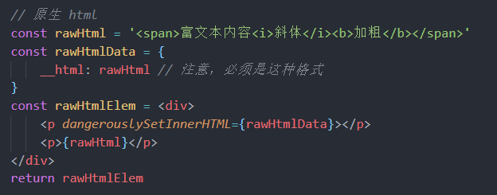
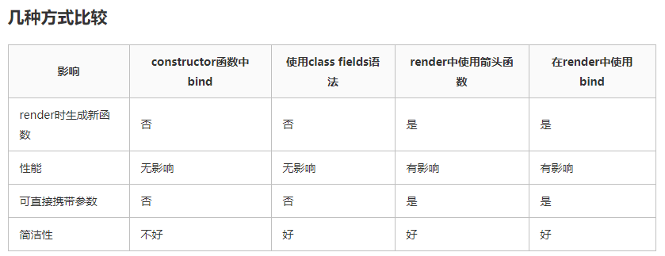
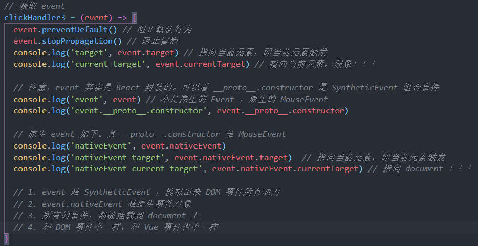
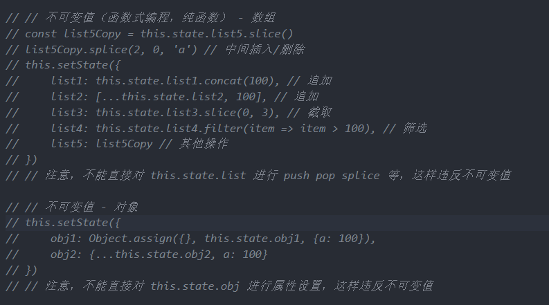
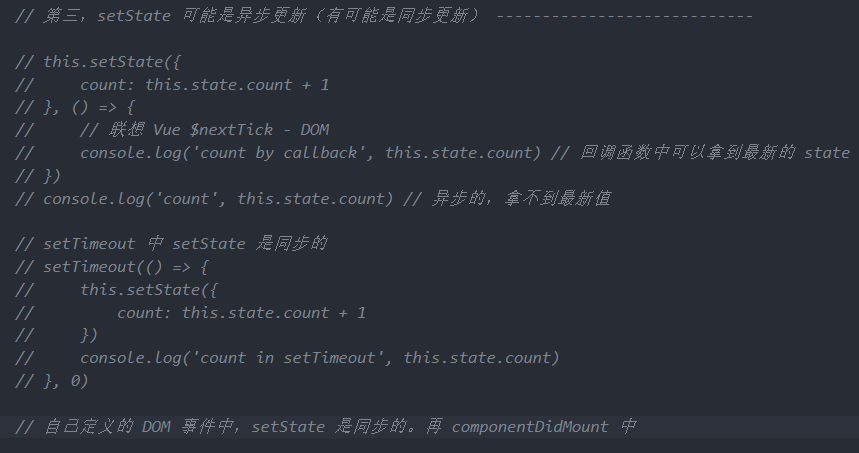
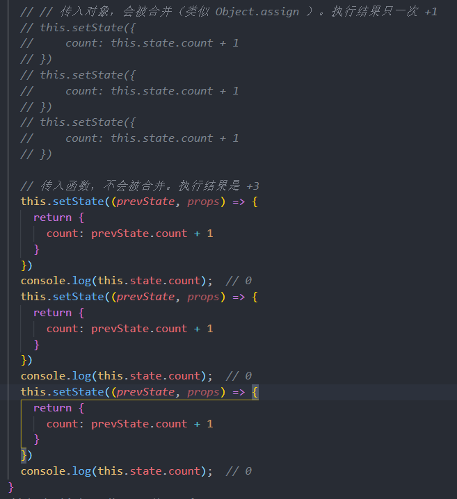
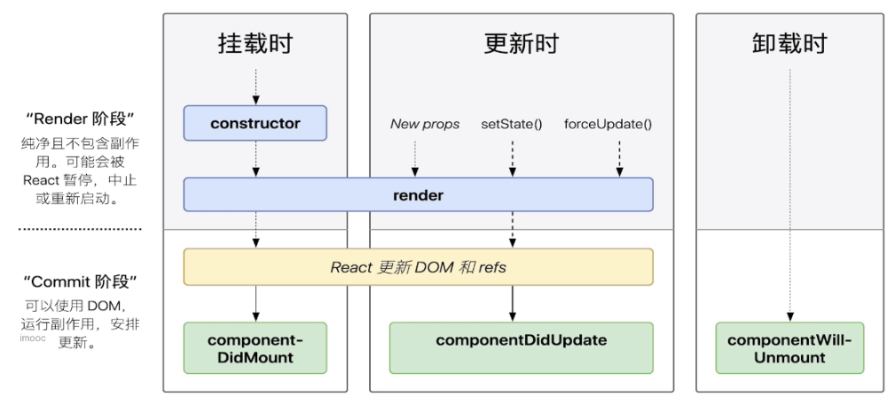
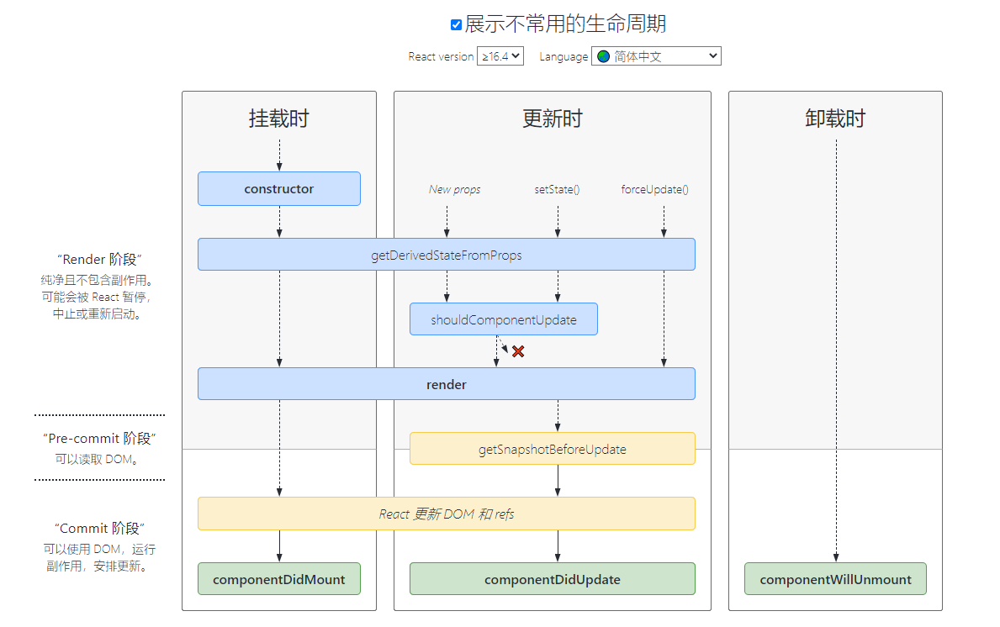
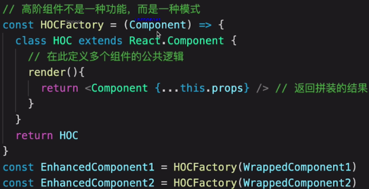

# React 篇

React和Vue一样重要（特别是大厂面试），力求两者都会  
React和Vue有很多相通之处，而且正在趋于一致  
React比Vue学习成本高，尤其对于初学者  

## 1. 基本使用（必会）

#### 1：JSX使用
变量表达式、class style、子元素和组件



#### 2：条件判断
if/else、三元表达式、逻辑运算符&&或者||

#### 3：列表渲染
map（带key）

#### 4：事件（重点）
1）bind this（三种形式，使用类时：构造函数内绑定this、class fields、回调中使用箭头函数）   



2）关于event参数（重要）   
参考之后章节  



3）传递自定义参数  
```
<button onClick={(e) => this.deleteRow(id, e)}>Delete Row</button>
<button onClick={this.deleteRow.bind(this, id)}>Delete Row</button>
```
上述两种方式是等价的，分别通过箭头函数和 Function.prototype.bind 来实现。

#### 5：表单
受控组件和非受控组件  
使 React 的 state 成为表单元素的"唯一数据源" => 受控组件  
表单数据将交由 DOM 节点自己来处理，React 的 state 不作为表单元素的"唯一数据源" => 非受控组件

<hr>

## 2. 组件使用

#### 1：setState（非常重要）
1）不可变值(注意)
```
// 不要直接修改 state ，使用不可变值 
// this.state.count++ // 错误,如违反不可变值原则,会影响 shouldComponentUpdate 
// this.setState({
//     count: this.state.count + 1    
// })
```
 
 
2）可能是异步更新（三种情况）
1. 普通使用是异步的；
2. setTimeout/setInterval/自定义DOM事件回调中是同步的
具体原因可以参考后面章节的batchUpdate机制

 
 
3）可能会被合并 
1. 传入对象会被合并；
2. 传入函数则不会被合并

  

#### 2：组件生命周期（重要、会画）
参考：http://projects.wojtekmaj.pl/react-lifecycle-methods-diagram/  

  
 
可以关注下shouldComponentUpdate，其他的无需关注  

   
 
父子组件生命周期和vue完全一样

<hr>

## 3. 高级特性
1. 函数组件   
2. 非受控组件   
3. Portals   
4. context  
5. 异步组件  
6. 性能优化  
7. 高阶组件HOC  
8. Render Props  

#### 1：函数组件
1. 纯函数，输入props，输出JSX  
2. 没有实例，没有周期，没有state。但是hooks 可以给函数组件引入状态和生命周期等  

#### 2：非受控组件
在大多数情况下，我们推荐使用受控组件来处理表单数据。在一个受控组件中，表单数据是由 React 组件来管理的。另一种替代方案是使用非受控组件，这时表单数据将交由 DOM 节点来处理。  
关键词：Ref、defaultValue、defaultChecked、React.createRef()

###### 使用场景：
1. 必须手动操作DOM元素，setState实现不了时  
2. 文件上传input  
3. 某些富文本编辑器，需要传入DOM元素（绑定在某个元素）

#### 3：Portals
Portal 提供了一种将子节点渲染到存在于父组件以外的 DOM 节点的优秀的方案。  
ReactDOM.createPortal(child, container)  
参考官网  

#### 4：context
context 提供了一个无需为每层组件手动添加 props，就能在组件树间进行数据传递的方法。  
应用场景+核心api 
参考官网  

#### 5：异步组件
React.lazy  
React.Suspense  


#### 6：React 性能优化（针对React，性能优化是重点）
性能优化对React更加重要  
1）shouldComponentUpdate  
1. React默认：父组件更新，则子组件无条件更新，默认返回true
2. SCU一定要每次都用吗？不一定，需要时才优化
3. 当用户输入不规范时，直接操作state，如this.state.list.push(xx)，SCU将不再有效果，故SCU必须配合不可变值书写
   

 
2）PureComponent/React.memo  
PureComponent，SCU中实现了浅比较（只比较第一层）  
Memo：函数组件中的PureComponent  
浅比较已经适用大部分内容，state层级尽量低（尽量避免深度比较，耗费性能 ）

3）不可变值immutable.js（了解）  
彻底拥抱不可变值
基于共享数据（不是深拷贝），速度快  


#### 7：关于组件公共逻辑的抽离
1. Mixin，已被React弃用  
2. 高阶组件 HOC（注意透传所有props）  
3. Render Props
4. hook

  
参考官网

###### 对比：
HOC：模式简单，但会增加组件层级  
Render Props：代码简洁，学习成本较高

<hr>

## 4. 扩展
#### Redux的使用（常考）
基本概念  
store state  
action  
reducer  
dispatch(action)  
reducer => newState  
subscribe触发通知  
   
react-redux  
Provider  
connect  
mapStateToProps及mapDispatchToProps  

Redux 处理异步  
redux-thunk  
```
const actions = {
  ...
  incrementAsync: (num) => {
    // 返回函数，携带dispatch参数
    return dispatch => {
      setTimeout(() => {
        console.log('INCREMENTASYNC');
        dispatch({ type: constants.INCREMENTBYAMOUNT, payload: num })
      }, 1000)
    }
  }
}
---------------------------------------------------
import { combineReducers } from 'redux'
import count from './count'
import user from './user'
const rootReducer = combineReducers({
  count,
  user
})

export default rootReducer
---------------------------------------------------
import { createStore, applyMiddleware } from 'redux';
import thunk from 'redux-thunk' // 异步action
import rootReducer from './reducer/index' // combineReducers
import { composeWithDevTools } from 'redux-devtools-extension'; // 配合开发工具
const store = createStore(rootReducer, composeWithDevTools(applyMiddleware(thunk)))
export default store
```

#### React-router
面试考点不多  
路由模式，同Vue  
路由配置（动态路由、懒加载），同Vue    
```
import React, { Suspense } from 'react';
import { HashRouter, Route, Switch } from 'react-router-dom';

import './App.css';
const Counter = React.lazy(() => import(/* webpackChunkName: "Counter" */ './demos/counter/Counter'));
const User = React.lazy(() => import(/* webpackChunkName: "User" */ './demos/user/User'));
const UserRedux = React.lazy(() => import(/* webpackChunkName: "UserRedux" */ './demos/user/User-redux'));
const useReducerDemo = React.lazy(() => import(/* webpackChunkName: "useReducerDemo" */ './demos/useReducer/useReducer'));

function App() {
  return (
    <div className="App">
      <Suspense fallback={<div>Loading...</div>}>
        <header className="App-header">
          <HashRouter basename="/app">
            <Switch>
              <Route path="/counter" exact component={Counter}>
              </Route>
              <Route path="/user" strict exact component={User}>
              </Route>
              <Route path="/user-redux" strict exact component={UserRedux}>
              </Route>
              <Route path="/user-reducer" strict exact component={useReducerDemo}>
              </Route>
            </Switch>
          </HashRouter>
        </header>
      </Suspense>
    </div >
  );
}
``` 
 <hr>

## 5. React 原理

#### 1：牢记不可变值  

#### 2：vdom和diff  
h函数  
vnode数据结构   
patch函数  
1. 只比较同一层级，不跨级比较  
2. tag不同，则删除重建，不再深度比较  
3. tag和key，两者都相同，则认为是相同节点，不再深度比较  
大大降低了diff计算复杂度  

Vue2.x、Vue3.0、React 三者实现vdom细节都不同  
核心概念和实现思路，都一样  
面试主要考察核心概念和实现思路，非全部核心细节  

#### 3：JSX本质
JSX等同于Vue模板  
Vue模板非html  
JSX也不是js  
(babel网站中可以编译试一试)  
```
React.createElement('div',null,[child1,child2,child3])
React.createElement('div',null,child1,child2,child3)
React.createElement(List,null,[child1,child2,child3])
// 通过参数1首字母大写判断是否是React组件
```
JSX 的本质就是一个React.createElement 函数，即h函数，他接收多个参数来返回Vnode  
第一个参数，可能是组件，也可能是html tag  
组件名称在JSX中首字母必须大小写（区分h函数的第一个参数是 html tag string，还是个组件变量名）  

#### 4：React 的合成事件
所有事件都挂载在document中  
event 不是原生的，是SyntheticEvent合成事件对象  
和Vue事件不同，和DOM事件也不同  


###### 为什么要使用合成事件机制
1. 抹平浏览器之间的兼容性差异。 这是估计最原始的动机。

2. 事件"合成", 即事件自定义。事件合成除了处理兼容性问题，还可以用来自定义高级事件，比较典型的是React的onChange事件，它为表单元素定义了统一的值变动事件。

3. 抽象跨平台事件机制。 和VirtualDOM的意义差不多，VirtualDOM抽象了跨平台的渲染方式，那么对应的SyntheticEvent目的也是想提供一个抽象的跨平台事件机制。

4. React打算做更多优化。比如利用事件委托机制，大部分事件最终绑定到了Document，而不是DOM节点本身. 这样简化了DOM事件处理逻辑，减少了内存开销。 但这也意味着，React需要自己模拟一套事件冒泡的机制。

5. React打算干预事件的分发。v16引入Fiber架构，React为了优化用户的交互体验，会干预事件的分发。不同类型的事件有不同的优先级，比如高优先级的事件可以中断渲染，让用户代码可以及时响应用户交互。 

#### 5：setState 和 batchUpdate
有时异步（普通使用）有时同步（setTimeout/自定义DOM事件）  
有时合并（对象形式），有时不合并（函数形式）  
1：setState主流程  
2：batchUpdate机制  
https://blog.csdn.net/qq_39207948/article/details/113803273

setState无所谓异步还是同步，看是否命中batchUpdate机制，判断isBatchingUpdates  
###### 哪些能命中batchUpdate机制：  
1）生命周期（和它调用的函数）  
2）React中注册的事件（和它调用的函数）  
3）React可以管理的入口  
###### 哪些不能命中batchUpdate机制：  
1）setTimeout/setInterval等（和它调用的函数）  
2）自定义的DOM事件（和它调用的函数）  
3）React管不到的入口  

6：transaction(事务)机制  

机制.png)  


#### 7：组件渲染和更新过程
JSX如何渲染为页面  
setState之后如何更新页面  
组件渲染:  
1）props/state  
2）render()生成vnode  
3）patch(elem,vnode)  
组件更新：  
1）setState(newState)=>dirthComponents(可能含有子组件)  
2）render()生成newVode  
3）patch(vnode, newVnode)  

更新的两个阶段  
上述的patch被拆分成两个阶段：  
1）reconciliation阶段，执行diff算法，纯js计算  
2）commit 阶段，将diff结果渲染成dom  
可能会有性能问题：  
1. js是单线程，且和DOM渲染共用一个线程
2. 当组件足够复杂，组件更新时计算和渲染的压力都很大
3. 同时再有DOM操作需求（动画、鼠标拖拽等），页面将卡顿  

React fiber如何优化性能：
1. 将reconciliation阶段进行任务拆分（commit 无法拆分）
2. DOM需要渲染时暂停，空闲时恢复  
3. window.requestIdleCallback（了解即可）
备注：window.requestIdleCallback()方法将在浏览器的空闲时段内调用的函数排队。这使开发者能够在主事件循环上执行后台和低优先级工作，而不会影响延迟关键事件，如动画和输入响应。函数一般会按先进先调用的顺序执行，然而，如果回调函数指定了执行超时时间timeout，则有可能为了在超时前执行函数而打乱执行顺序

## 6. React 真题演练
#### 1：组件间如何通讯
父子组件props
自定义事件
Redux和Context

#### 2：JSX本质
JSX 的本质就是一个React.createElement 函数，即h函数，他接收多个参数来返回Vnode

#### 3：context是什么，如何应用
父组件，向其下所有子孙组件传递信息  
如一些简单的公共信息：主题色、语言等  
复杂的公共信息，用redux  

#### 4：shouldComponentUpdate用途
性能优化  
(配合"不可变值"一起使用，否则会出错) 
shouldComponentUpdate函数是重渲染时render()函数调用前被调用的函数，它接受两个参数：nextProps和nextState，分别表示下一个props和下一个state的值。并且，当函数返回false时候，阻止接下来的render()函数的调用，阻止组件重渲染，而返回true时，组件照常重渲染。组件默认返回true，通过自定义判断是否需要重渲染，来实现性能优化

#### 5：redux单向数据流


#### 6：setState场景题


#### 7：什么是纯函数
返回一个新值，没有副作用（不会偷偷修改其他值）  
重点是不可变值  

#### 8：组件生命周期
参考之前内容

#### 9：React发起ajax应该在哪个生命周期
componentDidMount
我们应当将AJAX 请求放到 componentDidMount 函数中执行，主要原因有下：
1.React 下一代调和算法 Fiber 会通过开始或停止渲染的方式优化应用性能，其会影响到 componenТWillMount 的触发次数。对于 componenТWillMount 这个生命周期函数的调用次数会变得不确定，React 可能会多次频繁调用 componenТWillMount。如果我们将 AJAX 请求放到 componenТWillMount 函数中，那么显而易见其会被触发多次，自然也就不是好的选择。
2.如果我们将 AJAX 请求放置在生命周期的其他函数中，我们并不能保证请求仅在组件挂载完毕后才会要求响应。如果我们的数据请求在组件挂载之前就完成，并且调用了setState函数将数据添加到组件状态中，对于未挂载的组件则会报错。而在 componentDidMount 函数中进行 AJAX 请求则能有效避免这个问题。

#### 10：渲染列表，为何使用key
同vue

#### 11：函数组件和类组件区别
纯函数，输入props，输出JSX  
没有实例，没有生命周期，没有state  
不能扩展其他方法  

#### 12：什么是受控组件
表单的值，受state控制 
需要自行监听onChange，更新state 
对比非受控组件 

#### 13：何时使用异步组件
同vue  
加载大组件  
路由懒加载  

#### 14：多个组件如何抽离公共逻辑
高阶组件  
Render Props  
Hook  

#### 15：redux 如何进行异步请求
使用异步action  
如使用redux-thunk  

#### 16：react-router 如何配置懒加载


#### 17：pureComponent有何作用
实现了浅比较的SCU  
性能优化  
需要结合不可变值的使用  

#### 18：React事件和DOM事件的区别
参考之前内容

#### 19：React 性能优化
1. 渲染列表使用key
2. 自定义事件、DOM事件及时销毁
3. 合理使用异步组件
4. 减少函数bind this的次数
（因为这样每次render都会进行一次bind操作消耗性能）
5. 合理使用SCU PureComponent和memo
6. Webpack层面的优化
7. 前端通用的性能优化，如图片懒加载

#### 20：React 和Vue的区别
###### 共同点：
都支持组件化  
都是数据驱动视图  
都使用vdom 操作DOM  
###### 区别：
React使用JSX拥抱JS，Vue使用模板拥抱html  
React函数式编程，Vue声明式编程  
React更加灵活，需要自力更生，Vue把想要的都给你，添加了很多用法  
