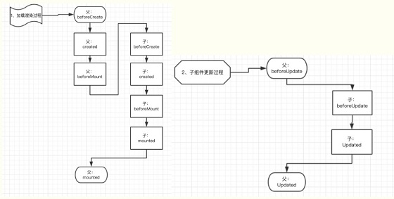
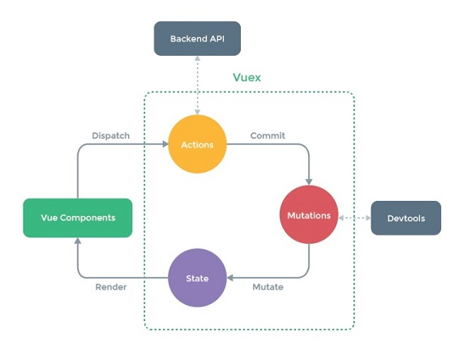
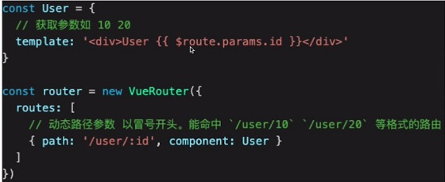
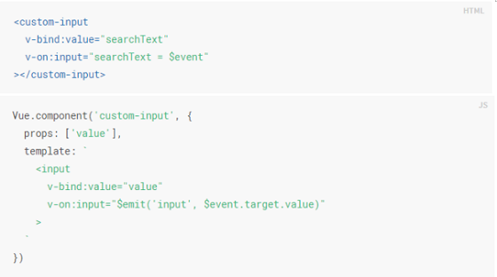

# Vue篇

## 1. Vue基本使用（必会）

#### 1：插值 表达式 
#### 2：指令、动态属性 
#### 3：v-html：会有XSS风险、会覆盖子组件
#### 4：computed和watch
- computed 有缓存，data不变化则不会重新计算，取决于依赖项是否变化  
- watch如何深度监听
```js
watch:{  
  name:{  
    handler(oldVal, newVal ){  
      // do something  
    },  
    deep:true  
  }  
}  
```
- watch 监听引用类型，拿不到oldVal， 因为引用类型是指针赋值，新值旧值指向同一个地址  

#### 5：class和style
使用动态属性 对象语法 数组语法  
使用驼峰写法  

#### 6：条件渲染
- v-if/v-else-if/v-else 用法，可以使用变量，也可以使用===等判断表达式  
- v-if和v-show的区别：v-if控制组件的渲染与销毁，v-show通过设置display 控制隐藏和显示  
- v-if和v-show的使用场景：频繁切换用v-show(v-if渲染代价更大)，切换不频繁或者只判断一次的使用v-if  

#### 7：循环（列表）渲染 v-for 
- key的重要性，key不能乱写，必须唯一，最好是唯一id  
key是为Vue中vnode标记的唯一id，通过这个key,我们的diff操作可以更准确、更快速  
准确: 如果不加key，那么vue会选择复用节点(Vue的就地更新策略)，导致之前节点的状态被保留下来，会产生一系列的bug  
快速: key的唯一性可以被Map数据结构充分利用，相比于遍历查找的时间复杂度O(n)，Map的时间复杂度仅仅为O(1)  

- v-for 和v-if 不能一起使用    
v-for的优先级高过v-if，所以会对循环体内的每一项使用v-if进行判断，因此哪怕我们只渲染出一小部分用户的元素，也得在每次重渲染的时候遍历整个列表，不论活跃用户是否发生了变化，从而导致不必要的计算。通常可以使用computed对数据先进行过滤

#### 8：事件
- event参数、自定义参数  
模板中使用$event 表示"原生事件"对象，比如increment(payload,$event)，打印event.currentTarget会发现事件被注册到当前元素上，和react不同，react是合成事件。  
**关注点：**  
1）事件是原生的  
2）事件被注册到当前元素上  

- 事件修饰符，按键修饰符  
```js
<!-- 事件修饰符 -->

<!-- 阻止单击事件继续传播 -->
<a v-on:click.stop="doThis"></a>

<!-- 提交事件不再重载页面 -->
<form v-on:submit.prevent="onSubmit"></form>

<!-- 修饰符可以串联 -->
<a v-on:click.stop.prevent="doThat"></a>

<!-- 只有修饰符 -->
<form v-on:submit.prevent></form>

<!-- 添加事件监听器时使用事件捕获模式 -->
<!-- 即内部元素触发的事件先在此处理，然后才交由内部元素进行处理 -->
<div v-on:click.capture="doThis">...</div>

<!-- 只当在 event.target 是当前元素自身时触发处理函数 -->
<!-- 即事件不是从内部元素触发的 -->
<div v-on:click.self="doThat">...</div>

<!-- 点击事件将只会触发一次 -->
<a v-on:click.once="doThis"></a>

<!-- 滚动事件的默认行为 (即滚动行为) 将会立即触发 -->
<!-- 而不会等待 `onScroll` 完成  -->
<!-- 这其中包含 `event.preventDefault()` 的情况 -->
<div v-on:scroll.passive="onScroll">...</div>

```

```js
<!-- 按键修饰符 -->

<!-- 只有在 `key` 是 `Enter` 时调用 `vm.submit()` -->
<input v-on:keyup.enter="submit">

<!-- Alt + C -->
<input v-on:keyup.alt.67="clear">

<!-- Ctrl + Click -->
<div v-on:click.ctrl="doSomething">Do something</div>

<!-- 即使 Alt 或 Shift 被一同按下时也会触发 -->
<button v-on:click.ctrl="onClick">A</button>

<!-- 有且只有 Ctrl 被按下的时候才触发 -->
<button v-on:click.ctrl.exact="onCtrlClick">A</button>

<!-- 没有任何系统修饰符被按下的时候才触发 -->
<button v-on:click.exact="onClick">A</button>
```

#### 9：表单
v-model  
常见表单项 textarea checkbox radio select  
修饰符 lazy number trim  
Lazy 具备防抖效果，输入过程中value不会变化，在输完后才变化  

---

## 2. Vue组件使用（必会）

#### 1：props和$emit
- 父=>子 props v-bind:name="name" 或者 :name="name"  
- 子=>父 $emit 父组件中使用@userEvent="userMethod"监听自定义事件  

#### 2：组件间通讯、自定义事件
1. 父=>子 props   
2. 子=>父 $emit     
3. 自定义事件（事件总线 ），eventBus = new Vue(), 常用于兄弟组件、远距离组件等， $on、$off、$once、$emit。使用时注意及时解绑自定义事件  
4. vuex  
5. inject  provide  
6. 获取父子组件实例 $parent、$children、$refs 获取实例的方式调用组件的属性或者方法  

#### 3：组件生命周期（必考，可能涉及父子组件）
- Vue生命周期经历哪些阶段：  
   - 总体来说：初始化、运行中、销毁  
   - 详细来说：开始创建、初始化数据、编译模板、挂载Dom、渲染→更新→渲染、销毁等一系列过程  

- 详见下页图，必须会画  
- 至少知道created和mounted的区别  
- beforeDestroy 里注意解除事件监听、定时器等  




**生命周期经历的阶段和钩子函数**

1：实例化vue(组件)对象：  
new Vue()

2：初始化事件和生命周期  
init events 和 init cycle

3：beforeCreate函数：  
在实例初始化之后，数据观测 (data observer) 和 event/watcher 事件配置之前被调用。即：  
此时vue（组件）对象被创建了，但是vue对象的属性还没有绑定，如data属性，computed属性还没有绑定，即没有值。

4：挂载数据（属性赋值）  
包括属性和computed的运算

5：created函数：  
vue对象的属性有值了，但是DOM还没有生成，$el属性还不存在。
此时有数据了，但是还没有真实的DOM，即：
data，computed都执行了。属性已经赋值，但没有动态创建template属性对应的HTML元素，所以，此时如果更改数据不会触发updated函数

6：检查  
1）检查是否有el属性  
检查vue配置，即new Vue{}里面的el项是否存在，有就继续检查template项。没有则等到手动绑定调用vm.$mount();  

2）检查是否有template属性  
检查配置中的template项，如果没有template进行填充被绑定区域，则被绑定区域的el对象的outerHTML（即整个#app DOM对象，包括`<div id="app" >`和`</div>`标签）都作为被填充对象替换掉填充区域，即：如果vue对象中有 template属性，那么，template后面的HTML会替换$el对应的内容。如果有render属性，那么render就会替换template。
即：优先关系是： render  >  template > el

7：beforeMount函数：  
模板编译(template)、数据挂载(把数据显示在模板里)之前执行的钩子函数  
此时 this.$el有值，但是数据还没有挂载到页面上。即此时页面中的{{ }}里的变量还没有被数据替换

8：模板编译：  
用vue对象的数据（属性）替换模板中的内容

9：mounted函数：  
模板编译完成，数据挂载完毕，此时已经把数据挂载到了页面上，页面上能够看到正确的数据了。
一般来说，我们在此处发送异步请求（ajax，fetch，axios等），获取服务器上的数据，显示在DOM里。

10：beforeUpdate函数：  
组件更新之前执行的函数，只有数据更新后，才能调用（触发）beforeUpdate，注意：此数据一定是在模板上出现的数据，否则，不会也没有必要触发组件更新（因为数据不出现在模板里，就没有必要再次渲染）
数据更新了，但是，vue（组件）对象对应的dom中的内部（innerHTML）没有变，所以叫作组件更新前

11：updated函数：
组件更新之后执行的函数，vue（组件）对象对应的dom中的内部（innerHTML）改变了

12：activated函数：keep-alive组件激活时调用

13：deactivated函数：keep-alive组件停用时调用

14：beforeDestroy：vue（组件）对象销毁之前
注意解除事件监听、定时器等

15：destroyed：vue组件销毁后

---

## 3. Vue高级特性

不是每个都很常用，但是用到时必须知道  
考察候选人对vue的掌握是否全面，且是否有深度  
考察做过的项目是否有深度和复杂度（至少能用到高级特性）  

1：自定义 v-model  
2：$nextTick  
3：refs  
4：slot  
5：动态/异步组件  
6：keep-alive  
7：mixin  

#### 1：自定义 v-model  


#### 2：$nextTick
异步渲染，$nextTick 待DOM渲染后再回调  
页面渲染时会将data的修改做整合，多次data修改只会渲染一次  
1: nextTick批量异步更新策略，一句话概括:   
在下次DOM更新循环结束之后执行延迟回调  

2: 它主要是为了解决：  
例如一个data中的数据，它的改变会导致视图的更新，而在某一个很短的时间被改变了很多次，假如是1000次，每一次的改变如果都都将促发数据中的setter并按流程跑下来直到修改真实DOM，那DOM就会被更新1000次，这样的做法肯定是非常低效的。

3: 在目前浏览器平台并没有实现nextTick方法，所以Vue.js 源码中分别用 Promise、setTimeout、setImmediate 等方式定义了一个异步方法nextTick，它接收的是一个回调函数，多次调用nextTick会将传入的回调函数存入队列中，当当前栈的任务都执行完毕之后才来执行这个队列中刚刚存储的那些回调函数，并且通过这个异步方法清空当前队列

#### 3：slot 插槽
1: 基本使用   
内容派发 备选（默认）内容 `<slot></slot>`

2: 作用域插槽    
父组件中的插槽内容访问子组件中的数据    
`<span> <slot v-bind:user="user"> {{ user.lastName }} </slot> </span>`

`<current-user> <template v-slot:default="slotProps"> {{ slotProps.user.firstName }} </template> </current-user>`      
缩写：  
`<current-user v-slot:default="slotProps"> {{ slotProps.user.firstName }} </current-user>`   

3: 具名插槽  
```js
<div class="container">
  <header>
    <!-- 我们希望把页头放这里 -->
  </header>
  <main>
    <!-- 我们希望把主要内容放这里 -->
  </main>
  <footer>
    <!-- 我们希望把页脚放这里 -->
  </footer>
</div>

<div class="container">
  <header>
    <slot name="header"></slot>
  </header>
  <main>
    <slot></slot>
  </main>
  <footer>
    <slot name="footer"></slot>
  </footer>
</div>
```


#### 4：动态组件
`<component v-bind:is="currentTabComponent"></component>`    
必须使用动态写法(:is)，适用于根据数据动态渲染的常见，组件类型不确定，可以用v-if语法。

#### 5：异步组件（重要）
1：import()函数  
2：按需加载，异步加载大组件  
配合魔法注释可以对异步chunk进行自定义命名  
```js
const AsyncComponent = () => ({
  // 需要加载的组件 (应该是一个 `Promise` 对象)
  component: import('./MyComponent.vue'),
  // 异步组件加载时使用的组件
  loading: LoadingComponent,
  // 加载失败时使用的组件
  error: ErrorComponent,
  // 展示加载时组件的延时时间。默认值是 200 (毫秒)
  delay: 200,
  // 如果提供了超时时间且组件加载也超时了，
  // 则使用加载失败时使用的组件。默认值是：`Infinity`
  timeout: 3000
})
```

#### 6：keep-alive
缓存组件  
频繁切换，不需要重复渲染  
vue常见的性能优化手段之一  
include - 字符串或正则表达，只有匹配的组件会被缓存  
exclude - 字符串或正则表达式，任何匹配的组件都不会被缓存（优先级高于include）  
使用include/exclude 属性需要给所有vue类的name赋值（注意不是给route的name赋值），否则 include/exclude不生效  
```js
<keep-alive include="a,b">
  <!-- 将缓存name为a或者b的组件，结合动态组件使用 -->
  <component :is="view"></component>
</keep-alive>
 
<!-- 使用正则表达式，需使用v-bind -->
<keep-alive :include="/a|b/">
  <component :is="view"></component>
</keep-alive>
 
<!-- 动态判断 -->
<!-- includedComponents是缓存的组件Array集合 -->
<keep-alive :include="includedComponents">
  <router-view></router-view>
</keep-alive>
 
<keep-alive exclude="excludeComponents">
  <!-- 将不缓存name为excludeComponents的组件 -->
  <component></component>
</keep-alive>
```

想保持这些组件的状态，以避免反复重渲染导致的性能问题  

#### 7：mixin
- 多个组件有相同的逻辑，抽离出来  
   - mixins：[mixinOne，mixinTwo...]  
   - 同名钩子函数将合并为一个数组，因此都将被调用。另外，混入对象的钩子将在组件自身钩子之前调用    
   - 当组件和混入对象含有同名选项时，这些选项将以恰当的方式进行“合并”。比如，数据对象在内部会进行递归合并，并在发生冲突时以组件数据优先    

- mixin并非完美的解决方案，会有一些问题  
   - 变量来源不明确，不利于阅读  
   - 多mixin时，容易造成命名冲突  
   - mixin和组件可能出现多对多的关系，复杂度高（维护火葬场）  

- vue3中的composition API旨在解决这些问题  

### 总结：
高级特性  
可以不深入，但必须知道  
熟悉基本用法，了解使用场景，最好能和自己的项目经验结合起来  

---

## 4. 扩展
#### Vuex使用  
面试考点并不多(熟悉vue后，vuex没有难度)  
基本概念，基本使用和API必须要掌握  
可能会考察state的数据结构设计（参考数据结构与组件设计章节）  

- Vuex基本概念  
   - state  
   - getters  
   - action  
   - mutation  

- 用于vue组件  
   - dispatch  
   - commit  
   - mapState  
   - mapGetter  
   - mapActions  
   - mapMutations  

理解流程（重要），只能在actions里进行异步操作，mutations进行同步操作，state只能通过mutations进行修改，不能直接修改  
必须会画  

 

#### Vue-router使用
面试考点并不多  
路由模式（hash、h5 history）  
路由配置（动态路由、路由懒加载）  
h5 history需要后端配置，无论请求什么地址，后端都返回index.html  
动态路由  

 

---

## 5. Vue原理(大厂必考) 原理≠源码

1：面试为何会考察原理？  
2：面试中如何考察？以何种方式？   
考察重点、而非细节  
和使用相关联的原理，如VDOM、模板渲染  
整体流程是否全面、热门技术是否有深度  
3：Vue原理包括哪些  
组件化/响应式/vnode和diff/模板编译/渲染过程/前端路由  

#### 1：如何理解MVVM模型  
M：model 数据模型  
V：view  UI视图  
VM：view-mode 连接M和V    
数据驱动视图

 
 

#### 2： 监听data变化的核心API（重点）
#### 3： 如何监听对象变化（重点）  
#### 4： 如何监听数组变化（重点）  

核心API：Object.defineProperty 有缺陷  
vue3：Proxy 兼容性不好，且无法polyfill  
1）深度监听，需要递归到底，一次性计算量大（嵌套层数尽量少）  
2）无法监听新增属性、删除属性（新增了Vue.set/ Vue.delete API）  
3）无法原生监听数组，需要特殊处理   

监听对象、监听数组、复杂对象，深度监听  

```js
// 触发更新视图  
function updateView () {
  console.log('视图更新')
}

// 重新定义数组原型
const oldArrayProperty = Array.prototype
// 创建新对象，原型指向 oldArrayProperty ，再扩展新的方法不会影响原型
const arrProto = Object.create(oldArrayProperty);
['push', 'pop', 'shift', 'unshift', 'splice', 'sort', 'reverse']
.forEach(methodName => {
  arrProto[methodName] = function () {
    updateView() // 触发视图更新
    oldArrayProperty[methodName].call(this, ...arguments)
  }
})
// 重新定义属性，监听起来
function defineReactive (target, key, value) {
  // 深度监听
  observer(value)
  // 核心 API
  Object.defineProperty(target, key, {
    get () {
      return value
    },
    set (newValue) {
      if (newValue !== value) {
        // 深度监听
        observer(newValue)
        // 设置新值, 注意，value 一直在闭包中，此处设置完之后，再 get 时也是会获取最新的值
        value = newValue
        // 触发更新视图
        updateView()
      }
    }
  })
}
// 监听对象属性
function observer (target) {
  if (typeof target !== 'object' || target === null) {
    // 不是对象或数组
    return target
  }
  if (Array.isArray(target)) {
    target.__proto__ = arrProto
  }
  // 重新定义各个属性（for in 也可以遍历数组）
  for (let key in target) {
    if(target.hasOwnProperty(key)){
      defineReactive(target, key, target[key])
    }
  }
}
// 准备数据
const data = {
  name: 'zhangsan',
  age: 20,
  info: {
    address: '北京' // 需要深度监听
  },
  nums: [10, 20, 30]
}
// 监听数据
observer(data)
// 测试
// data.name = 'lisi'
// data.age = 21
// // console.log('age', data.age)
// data.x = '100' // 新增属性，监听不到 —— 所以有 Vue.set
// delete data.name // 删除属性，监听不到 —— 所有已 Vue.delete
// data.info.address = '上海' // 深度监听
data.nums.push(4) // 监听数组
```

#### 5： 虚拟DOM（重要）
vdom 是实现vue和react的重要基石  
diff算法是vdom中最核心、最关键的部分  
vdom是一个热门话题，也是面试中的热门问题

有了一定的复杂度，想减少计算次数比较难  
能否把计算，更多地转移为js计算？因为js执行速度很快  
vdom用js模拟DOM结构，计算出最小的变更，操作DOM
 
操作DOM非常耗费性能  
以前用jq，可以自行控制DOM操作的时机，手动调整    
Vue和react是数据驱动视图，如何有效控制DOM操作？  
Virtual DOM 是用 VNode 这么一个Class 去描述  

会用vdom描述html结构，如下：
```js
<div class="title">
      <span>Hello ConardLi</span>
      <ul>
        <li>苹果</li>
        <li>橘子</li>
      </ul>
</div>

const VitrualDom = {
  tag: 'div',
  props: { className: 'title' },
  children: [
    {
      tag: 'span',
      children: 'Hello ConardLi'
    },
    {
      tag: 'ul',
      children: [
        { tag: 'li', children: '苹果' },
        { tag: 'li', children: '橘子' }
      ]
    }
  ]
}
```
<br>

vue3重写了vdom的代码，优化了性能  
但vdom的基本理念不变，面试考点不变
React和Vue的具体实现也不同，但是基本理念类似

#### 6： diff算法(重点)
diff算法是vdom中最核心、最关键的部分  
diff算法能在日常使用vue react 中体现出来（如key的使用）  
diff 算法是前端热门话题，面试宠儿  

[diff算法详解1](https://github.com/aooy/blog/issues/2]) 
[diff算法详解2](https://github.com/lihongxun945/myblog/issues/33)


diff即对比，是一个广泛的概念，如linux diff命令、git diff等    
两个js对象也可以做diff    
两棵树做diff，如这里的vdom diff   
复杂度O(n^3)=>O(n)   

只比较同一层级，不跨级比较  
tag不同，则直接删掉重建，不再深度比较  
tag和key，两者都相同，则认为是相同节点，不再做深度比较  
大大降低了复杂度   

三个主要的diff 算法（不要纠结细节）  


 
细节不重要，updateChildren的过程也不重要，不要深究  
vdom核心概念很重要：h、vnode、patch、diff、key等  
vdom存在的价值更加重要：数据驱动视图，控制DOM操作等  


 


#### 7：模板编译
 
 
  

#### 8：组件渲染、更新过程
1）初次渲染过程  
1. 解析模板为render函数（或者在开发环境已完成，vue-loader）    
2. 触发响应式，监听data属性getter setter  
3. 执行render函数。生成vnode，然后patch(elem,vnode)   
执行render函数会触发getter（针对模板中使用到的数据），从而进行依赖收集

2）更新过程  
 1. 修改data，触发setter(此前在getter中已经被监听)  
 2. 重新执行render函数，生成newVnode  
 3. patch(vnode, newVnode)  

#### 9：异步渲染
$nextTick 汇总data修改，一次性更新视图，减少DOM操作次数，提高性能  
组件渲染/更新过程（重要）  


#### 10： 前端路由原理
稍微复杂的SPA，都需要前端路由，Vue-router是vue全家桶标配之一，属于"和日常使用相关联的原理"，面试常考。

**路由模式**  
1. hash  
2. H5 history  

- hash 模式
   - 形如：http://ai.huawei.com/nlp/aila_conference/#/home  
   - location.hash => #/home 
   - hash 的特点  
      - hash变化会触发网页跳转，即浏览器的前进后退  
      - hash变化不会刷新页面，SPA必需的特点  
      - hash永远不会提交到server端  

 

- H5 history 模式  
   - 用url规范的路由，但跳转时不刷新页面  
   - histroy.pushState：  
      - 打开一个新的路由【注意】用 pushState 方式，浏览器不会刷新页面  
   - window.onpopstate：  
      - 监听浏览器前进、后退  


Vue原理总结：组件化、响应式 、vdom和diff 、模板编译、渲染过程、前端路由 

---

## 6. 面试真题演练：
#### 1：v-show和v-if 的区别
1. v-show 通过css display 控制显示和隐藏  
2. v-if组件真正的渲染和销毁，而不是显示和隐藏  
3. 频繁切换显示状态用v-show，否则v-if  

#### 2：为何在v-for中使用key  
1. 必须使用key，且不能是index和random  
2. Diff算法中通过tag和key来判断是否是sameNode  
3. 减少渲染次数，提升渲染性能  
key是为Vue中的vnode标记的唯一id，通过这个key，我们的diff操作可以更准确、更快速  
准确: 如果不加key,那么vue会选择复用节点(Vue的就地更新策略),导致之前节点的状态被保留下来,会产生一系列的bug  
快速: key的唯一性可以被Map数据结构充分利用,相比于遍历查找的时间复杂度O(n),Map的时间复杂度仅仅为O(1)  

#### 3：描述vue组件生命周期（如包括父子组件呢？）
1. 单组件生命周期图会画  
2. 父子组件生命周期关系（最好知道为什么）  

#### 4：vue组件如何通讯（常见）
1. 父子组件props 和 $emit  
2. 自定义事件event.$on/event.$off/event.$emit/event.$once，即事件总线 EventBus  
3. vuex  
4. $refs $parent等

#### 5：描述组件渲染和更新过程
会画和描述流程图


#### 6：双向数据绑定v-model的实现原理
v-model本质就是一个语法糖，可以看成是value + input方法的语法糖。可以通过model属性的prop和event属性来进行自定义。原生的v-model，会根据标签的不同生成不同的事件和属性。  

text 和 textarea 元素使用 value 属性和 input 事件；
checkbox 和 radio 使用 checked 属性和 change 事件；
select 字段将 value 作为 prop 并将 change 作为事件。



#### 7：对MVVM的理解
会画模型图  
MVVM是Model-View-ViewModel缩写，Model层代表数据模型，View代表UI视图，ViewModel是View和Model层的桥梁，数据会绑定到viewModel层并自动将数据渲染到页面中，view中由于用户交互操作而改变的数据也会在Model中同步,从而实现数据驱动视图的效果


#### 8：computed有何特点
具有缓存性，data不变不会重新计算  
缓存性，提高了性能  

#### 9：为何组件data必须是一个函数
定义组件时，组件实际上是一个类，使用组件时，将对组件实例化，这些实例用的都是同一个构造函数。如果data不是一个函数，那么所有的组件实例将引用同一个data，造成状态共享  

#### 10：ajax请求应该放在哪个生命周期
mounted里，js是单线程，ajax是异步获取数据，放在mounted之前没有用，只会让逻辑更加混乱  

#### 11：如何将组件所有props传递给子组件
`<User v-bind="$props" />` 

#### 12: 实现自己的v-model 
一个组件上的 v-model 默认会利用名为 value 的 prop 和名为 input 的事件，但是像单选框、复选框等类型的输入控件可能会将 value attribute 用于不同的目的。model 选项可以用来避免这样的冲突


#### 13：多个组件有相同逻辑，如何抽离
Mixin以及mixin的一些缺点  

#### 14：何时使用异步组件
加载大组件、路由异步加载   

#### 15：何时需要使用keep-alive（可优化性能）
缓存组件、不需要重复渲染  
多个静态tab页的切换  
主要是有include、exclude、max三个属性；前两个属性允许keep-alive有条件的进行缓存；max可以定义组件最大的缓存个数，如果超过了这个个数的话，在下一个新实例创建之前，就会将以缓存组件中最久没有被访问到的实例销毁掉。两个生命周期activated/deactivated，用来得知当前组件是否处于活跃状态。  

#### 15：何时需要使用beforeDestroy
1. 解绑自定义事件event.$off  
2. 清除定时器  
3. 解绑自定义的DOM事件，如window scroll click等（模板中的事件会自动解绑）  

#### 16：什么是作用域插槽

 
有时让插槽内容能够访问子组件中才有的数据。绑定在 <slot> 元素上的 attribute 被称为插槽 prop  

#### 17：vuex中action 和mutation 有何区别
action 中处理异步，mutation 不可以，action 不能直接操作State  
mutation 做原子操作，专注于修改State，理论上是修改State的唯一途径  
action 可以整合多个mutation  

#### 18：vue-router常见的路由模式
hash模式（默认） onhashchange  
H5 history (需要服务端支持) history.pushState /onpopstate  

#### 19：如何配置vue-router 异步加载
```js
new Vue({
  //...
  components:{
    'my-component':()=>important('./my-async-component')  
  }
})
```

#### 20：请用vnode描述一个DOM结构
参考Vnode章节  

#### 21：监听data 变化的核心api
Object.defineProperty  
深度监听、监听数组  
有何缺点  
参考相关章节  

#### 22：vue如何监听数组变化
Object.defineProperty不能监听数组变化   
重新定义原型，重写push pop 等共6个方法，实现监听  
Proxy可以原生监听数组变化  

#### 23：请描述响应式原理
监听data变化+组件渲染和更新流程，组合回答即可    
Vue在初始化数据时，会使用Object.defineProperty重新定义data中的所有属性，当页面使用对应属性时，首先会进行依赖收集(收集当前组件的watcher)如果属性发生变化会通知相关依赖进行更新操作(发布订阅)。

#### 24：diff 算法的时间复杂度
O(n^3)=>O(n) 优化的思路  

#### 25：简述diff 算法过程
参考相关章节  
核心：  
patch(elem,vnode)和patch(vnode,newVnode)  
patchVnode 和addVnodes和removeVnodes  
updateChildren(key的重要性)  

#### 26：vue为何是异步渲染，$nextTick何用
异步渲染（以及合并data修改），以提高渲染性能  
$nextTick在DOM更新完之后，触发回调  

#### 27：再说一下computed和watch
computed本质是一个具备缓存的watcher，依赖的属性发生变化就会更新视图。适用于计算比较消耗性能的计算场景。当表达式过于复杂时，在模板中放入过多逻辑会让模板难以维护，可以将复杂的逻辑放入计算属性中处理。  

watch没有缓存性，更多的是观察的作用，可以监听某些数据执行回调。当我们需要深度监听对象中的属性时，可以打开deep：true选项，这样便会对对象中的每一项进行监听。 

使用Watch的深度监听可能会带来性能问题，优化的话可以使用字符串形式监听，如果没有写到组件中，也就是使用vm.$watch来设置监听的时候，这个vm.$watch是会返回一个取消观察函数，调用这个函数就可以手动注销监听了。

#### 28：Vue事件绑定原理说一下
原生事件绑定是通过addEventListener绑定给真实元素的，组件事件绑定是通过Vue自定义的$on实现的。  
换句话说：Vue支持 2 种事件类型，原生 DOM 事件和自定义事件。  
普通DOM和组件上挂了.native修饰符之后，最终调用的还是原生的addEventListener()方法
组件上，Vue实例上事件会调用原型上的$on、$emit、$off、$once等方法。  

#### 29：Vue常见的性能优化
1. 合理使用v-show/v-if  
2. 合理使用computed  
3. v-for时加key，避免和v-if同时使用如果需要使用v-for给每项元素绑定事件时使用事件代理  
4. 自定义事件、DOM事件及时销毁（避免内存泄漏）  
5. 使用路由懒加载、异步组件  
6. 合理使用keep-alive  
7. 防抖节流  
8. 第三方模块按需引入  
9. 长列表滚动到可视区域动态加载  
10. data层级不要太深（深度监听需要一次性遍历完成，造成遍历过多）  
11. 使用vue-loader 在开发环境做模板编译 vue-runtime 版本  
12. webpack层面（参考webpack相关章节）  
13. 前端通用性能优化，如图片懒加载  
    减少HTTP请求/减小cookie大小/将样式表放到页面顶部/将脚本放到页面底部/将javascript和css从外部引入/压缩javascript和css/服务使用Gzip压缩

## Vue3
面试会考察候选人对新技术的关注程度  
升级内容：
全部用ts重写（响应式，vdom，模板编译等）  
性能提升，代码量减少（tree shakeing 打包后的包体积）  
调整了部分API  
Proxy  

#### Proxy 实现响应式  


 

#### Reflect 作用
和proxy能力一一对应  
替代Object的工具函数 
标准化、 规范化、函数式（如下：）  


与Object.defineProperty 深度递归的区别是Proxy只在get时递归，不会一次性递归，而Object.defineProperty则是一次性递归完成  

#### Proxy特点
深度监听，性能更好  
可监听 新增、删除属性  
可监听数组变化  
无法兼容所有浏览器，无法polyfill(缺点)  