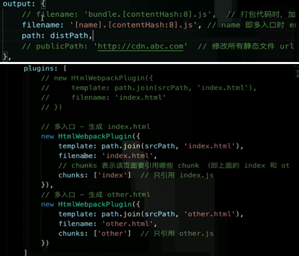
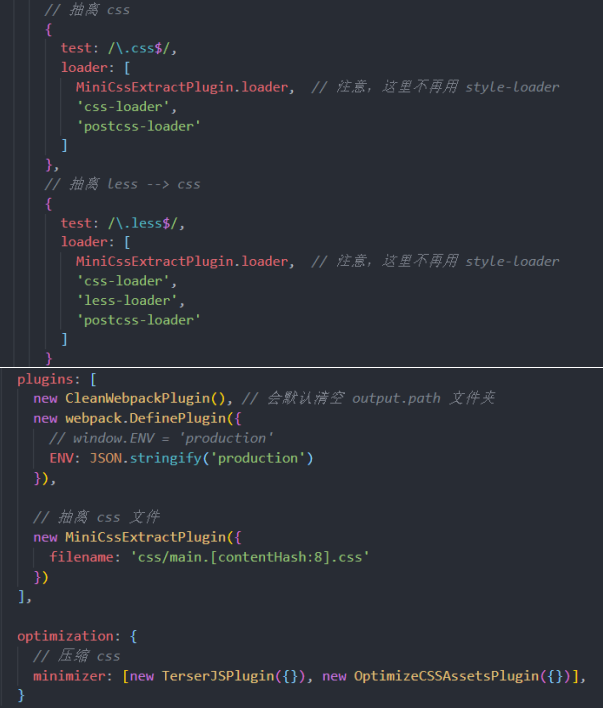
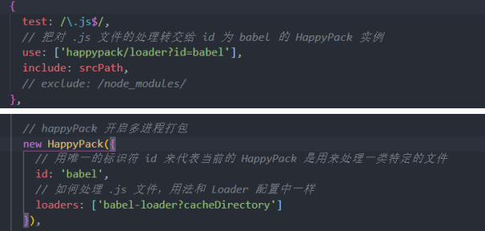
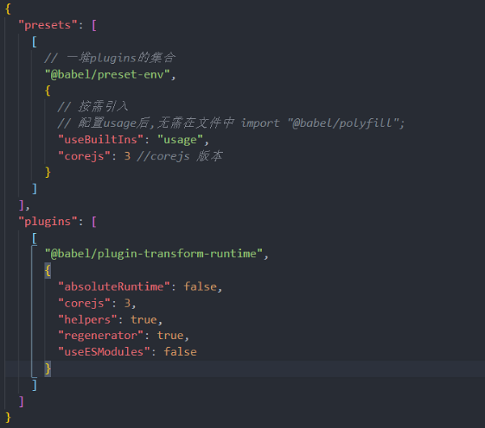

# Webpack篇
webpack已是前端打包构建的不二选择，必考    
重在配置和使用，不在原理  
[Webpack官网](https://webpack.docschina.org/concepts/)

基本配置  
高级配置  
优化打包速度  
优化产出代码    
Babel  

### 1）Webpack基本配置
必须掌握  

#### 1：拆分配置和merge
通常将基础配置、开发环境配置和生产环境配置分别进行设置，然后通过merge进行合并，根据scripts命令启用开发或者生产配置，从而构建出项目


#### 2：启动本地服务
webpack-dev-server插件   
devServer 配置项
```
var path = require('path');
module.exports = {
  //...
  devServer: {
    contentBase: path.join(__dirname, 'dist'),
    compress: true,
    port: 9000,
  },
};
```

#### 3：处理es6
babel-loader .babelrc文件 polyfill

#### 4：处理样式
style-loader css-loader scss-loader等css预处理loader postcss-loader(配合autoprefixer添加厂商前缀)

#### 5：处理图片
file-loader/url-loader(配合options limit 配置项可以控制是否按吧base64格式产出)

<hr>

### 2）Webpack高级配置
必须掌握  

#### 1：多入口
多个entry 
```
module.exports = {
  entry: {
    main: 'xxx1', // 入口1
    index: 'xxx2' // 入口2
  },
  output: {
    filename: '[name].[contentHash:8].js', // 使用8位contentHash命名入口chunk
    path: path.resolve(__dirname, 'dist'),
  }
}
```


#### 2：抽离css文件
常用于生产环境，开发环境没有必要(减少不必要的处理，加快构建速度，使用style-loader即可)



官网中提到的extract-text-webpack-plugin插件要依赖webpack3的版本。

#### 3：抽离公共代码（重要）
抽离公共代码及第三方代码，splitChunksPlugin（webpack已经内置）
如果node_modules包过大，还可以对node_modules里较大的包拆分提取出来，避免输出的bundle文件过大  


#### 4：实现异步加载
import(/*webpackChunkName: chunkName */ '待引入的chunk') 使用魔术注释法进行命名，默认使用id命名 
   


#### 5：处理JSX和vue
配合使用对应的loader即可
```
const module = {
  rules: [
    {
      test: /\.(js|jsx)$/,
      exclude: /(node_modules|bower_components)/,
      use: {
        loader: 'babel-loader',
        options: {
          presets: ['@babel/preset-env', '@babel/preset-react']
        }
      }
    }
  ]
};
```


#### 6：module chunk bundle 的区别
module：各源文件，在webpack中，一切皆模块  
chunk：多个模块合并合成的，比如entry、import()、splitChunk  
bundle：最终输出文件  

<hr>

### 3）webpack性能优化(重要）

优化打包构建速度---开发体验和效率  
优化产出代码---产品性能  

#### 1）优化打包构建速度
##### 1：优化babel-loader
1）开启缓存，未修改过的es6+代码，就不会重新编译  
2）限定打包范围 include or exclude(exclude优先级高于前者)


##### 2：IgnorePlugin
忽略第三方包指定目录，让这些指定目录不要被打包进去


```
new webpack.IgnorePlugin({
  resourceRegExp: /^\.\/locale$/,
  contextRegExp: /moment$/,
});
```
moment这个库中，如果引用了./locale/目录的内容，就忽略掉，不会打包进去

##### 3：noParse
用了noParse的模块将不会被loaders解析，所以当我们使用的库如果太大，并且其中不包含import、require、define的调用，我们就可以使用这项配置来提升性能， 让 Webpack 忽略对部分没采用模块化的文件的递归解析处理。


##### 4：happyPack（多进程打包）
多进程打包，提高构建速度（特别是多核CPU）



##### 5：ParallelUglifyPlugin（多进程压缩js，常用于生产环境）
webpack内置Uglify工具压缩js（单进程）

项目较大，打包较慢时，开启多进程能提高速度  
项目较小，打包很快，开启多进程可能会降低速度（进程开销）  
所以，按需使用


##### 6：自动刷新（开发环境）
启动webpack-dev-server会自动开启该功能


##### 7：热更新（开发环境）
不丢失状态HMR   


##### 8：DllPlugin 动态链接库插件（开发环境）
前端框架如vue React，体积大，构建慢  
较稳定，不常升级  
同一版本只构建一次即可，不用每次都重新构建  

webpack 已经内置DllPlugin支持  
DllPlugin---打包出dll文件（类似于第三方库）  
DllReferencePlugin---使用dll文件  


再将react.dll.js文件引入html模板中即可（切勿忘记）

#### 9：缩小文件的搜索范围(配置include exclude alias noParse extensions)
alias: 当我们代码中出现 import 'vue'时， webpack会采用向上递归搜索的方式去node_modules 目录下找。为了减少搜索范围我们可以直接告诉webpack去哪个路径下查找。也就是别名(alias)的配置。  
include exclude 同样。配置include exclude也可以减少webpack loader的搜索转换时间。  
extensions：webpack会根据extensions定义的后缀查找文件(频率较高的文件类型优先写在前面)  

#### 2）优化产出代码（比构建速度更重要）
体积更小  
合理分包，不重复加载  
速度更快，内存使用更小（代码执行更快）  

##### 1：小图片base64编码 (配合url-loader limit配置项)
##### 2：bundle加hash （使用contentHash，只有文件变更后才加载新内容）
##### 3：懒加载 import()
##### 4：提取公共代码(splitChunksPlugin)
##### 5：IngorePlugin （忽略第三方包指定目录，让这些指定目录不要被打包进去）
##### 6：使用CDN加速（通过配置publicPath）
##### 7：使用production模式
自动开启代码压缩、Vue/React等会自动删掉调试代码（如开发环境的warning），自动启动tree-shaking  

为了学会使用 tree shaking，你必须:  
1. 使用 ES2015 模块语法（即 import 和 export）
2. 在项目 package.json 文件中，添加一个 "sideEffects" 入口(注意，任何导入的文件都会受到 tree shaking 的影响。这意味着，如果在项目中使用类似 css-loader 并导入 CSS 文件，则需要将其添加到 side effect 列表中，以免在生产模式中无意中将它删除)
3. 引入一个能够删除未引用代码(dead code)的压缩工具(minifier)
```
// 开启 tree shaking
 optimization: {
   usedExports: true,
 },
```
备注：ES6 Module和Commonjs区别  
ES6 Module是静态引入，编译时引入，Commonjs是动态引入，执行时引入，所以只有ES6 Module才能静态分析，实现Tree-Shaking


##### 8：Scope Hoisting
代码体积更小  
创建函数作用域更少  
代码可读性更好  
Scope Hoisting 它可以让webpack打包出来的代码文件更小，运行更快，它可以被称作为 "作用域提升"。
[Scope Hoisting](https://blog.csdn.net/qq_36380426/article/details/107298332)


<hr>

### 4）babel 
[babel官网](https://www.babeljs.cn/setup#installation)    
需要了解基本的配置和使用，考察概率不高，但必须会  

#### 1）环境搭建+基本配置
环境搭建  
.babelrc配置 
presets和plugins  
(preset 可以作为 Babel 插件的组合)

备注:  
Babel默认只转换新的JavaScript语法(如箭头函数)，而不转换新的API。 例如，Iterator、Generator、Set、Maps、Proxy、Reflect、Symbol、Promise 等全局对象，以及一些定义在全局对象上的方法(比如 Object.assign)都不会转译。 如果想使用这些新的对象和方法，则需要为当前环境提供一个polyfill

#### 2）babel-polyfill
NOTE:  
As of Babel 7.4.0, this package has been deprecated in favor of directly including core-js/stable (to polyfill ECMAScript features) and regenerator-runtime/runtime (needed to use transpiled generator functions)
```
With webpack, there are multiple ways to include the polyfills:

When used alongside @babel/preset-env,

If useBuiltIns: 'usage' is specified in .babelrc then do not include @babel/polyfill in either webpack.config.
js entry array nor source. Note, @babel/polyfill still needs to be installed.

If useBuiltIns: 'entry' is specified in .babelrc then include @babel/polyfill at the top of the entry point to your 
application via require or import as discussed above.

If useBuiltIns key is not specified or it is explicitly set with useBuiltIns: false in your .babelrc, 
add @babel/polyfill directly to the entry array in your webpack.config.js.
```

babel-polyfill 存在的问题:  
###### 会污染全局环境  
如果做的是web系统，没有关系。如果作为一个library库，则会有负面影响  
解决方案：babel-runtime  
故如果输出的web系统，使用babel-polyfill，如果输出library库，使用babel-runtime

#### 3）babel-runtime  
@babel/plugin-transform-runtime



<hr>

### 5）面试真题
#### 1：前端为何要进行打包和构建
体积更小（Tree-Shaking、压缩、合并），加载更快  
编译高级语言或者语法（TS、ES6+、模块化、scss）  
兼容性和错误检查（polyfill、postcss、eslint）  
统一、高效的开发环境  
统一的构建流程和产出标准  
集成公司构建规范（提测、上线等）  

#### 2：module chunk bundle的区别
module：各源文件,在webpack中,一切皆模块  
chunk：多个模块合并合成的,比如entry import() splitChunk  
bundle：最终输出文件  

#### 3：loader和plugin的区别
loader模块转换器，如less->css  
plugin扩展插件，如HtmlWebpackPlugin  
相对于loader转换指定类型的模块功能，plugins能够被用于执行更广泛的任务比如打包优化、文件管理、环境注入等  

#### 4：常见loader和plugin有哪些
参考官网
[常见loader和plugin](https://blog.csdn.net/Cao_Mary/article/details/104465872)

#### 5：babel和webpack的区别
Babel---js新语法编译工具，不关心模块化  
Webpack---打包构建工具，是多个loader plugin的集合  
Babel 是编译工具，把高版本语法编译成低版本语法，或者将文件按照自定义规则转换成js语法。 webpack 是打包工具，定义入口文件，将所有模块引入整理后，通过loader和plugin处理后，打包输出。 webpack 通过 babel-loader 使用 Babel 。  

#### 6：如何产出一个lib
参考DllPlugin章节
output.library

#### 7：babel-polyfill 和babel-runtime的区别
前者会污染全局，后者不会，产出第三方lib要用babel-runtime

#### 8：webpack 如何实现懒加载
import()  
结合Vue React 异步组件  
结合Vue-router React-router异步加载路由  

#### 9:为何Proxy不能被Polyfill
Class 可以用function模拟  
Promise可以用callback模拟  
但是Proxy的功能用Object.defineProperty模拟

#### 10：优化构建速度
参考之前章节

#### 11：优化产出代码
参考之前章节
