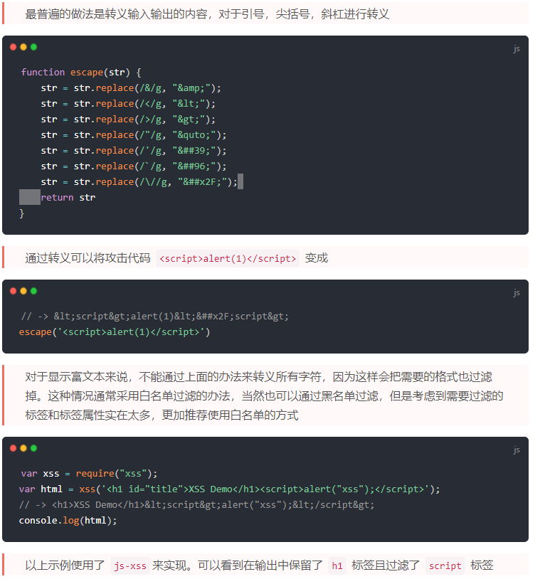
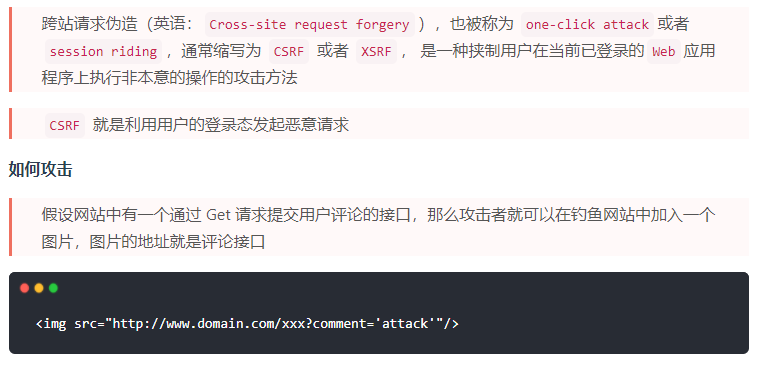

# 运行环境篇
- 运行环境即浏览器（或nodejs）
- 下载网页代码，渲染出页面，期间会执行若干js
- 要保障代码在浏览器中：稳定且高效

### 内容
- 网页加载过程
- 性能优化
- 安全
- 错误捕获


#### 1. 网页加载过程
- 什么是DOCTYPE及作用
- 输入url到渲染出页面的整个过程
- window.onload 和DOMContentLoaded的区别
  
### 什么是DOCTYPE及作用
`<!DOCTYPE>` 声明位于文档中的最前面，处于 `<html>` 标签之前。告知浏览器的解析器， 用什么文档类型 规范来解析这个文档
- 严格模式的排版和 JS 运作模式是 以该浏览器支持的最高标准运行
- 在混杂模式中，页面以宽松的向后兼容的方式显示。模拟老式浏览器的行为以防止站点无法工作。 
- DOCTYPE不存在或格式不正确会导致文档以混杂模式呈现

#### 输入url到渲染出页面的整个过程
- 加载资源的形式
  - html代码
  - 媒体文件，如图片，音视频等
  - js、css
- 加载过程
  - DNS解析：域名->IP地址（可能不同区域解析出不同的IP地址）
  - 浏览器根据IP地址向浏览器发起http请求
  - 服务器处理http请求，并返回给浏览器
- 渲染过程
  - 根据HTML代码生成DOM Tree
  - 根据css代码生成CSSOM Tree
  - 将DOM Tree和CSSOM Tree整合成Render Tree
  - 根据Render Tree渲染页面
  - 遇到script标签则暂停渲染，优先加载并执行js代码，完成再继续（共用同一线程）
  - 直至把Render Tree渲染完成
- 重绘和回流（重排）是什么，如何避免？
    - 重绘：当渲染树中的元素外观（如：颜色）发生改变，不影响布局时，页面重新绘制了一遍，产生重绘
    - 回流（重排）：当渲染树中的元素的布局（如：尺寸、位置、隐藏/状态状态）发生改变时，产生重绘回流
    - 注意：JS获取Layout属性值（如：offsetLeft、scrollTop、getComputedStyle等）也会引起回流。因为浏览器需要通过回流计算最新值
    - 回流必将引起重绘，而重绘不一定会引起回流 
- 如何最小化重绘(repaint)和回流(reflow)
    - 需要创建多个DOM节点时，使用DocumentFragment创建完后一次性的加入document
    - 缓存Layout属性值，如：var left = elem.offsetLeft; 这样，多次使用 left 只产生一次回流
    - 尽量避免用table布局（table元素一旦触发回流就会导致table里所有的其它元素回流）
    - 批量修改元素样式：elem.className 和 elem.style.cssText 代替`elem.style.xxx`

**思考**  
- css放在head标签中比css放在body标签尾部少了一次构建RenderTree, 一次计算布局和一次渲染网页, 性能会更好; 并且css放在body标签尾部时会在网页中短暂出现"裸奔"的HTML  
- js放body底部：避免阻塞渲染

#### window.onload 和DOMContentLoaded的区别
- window.onload()方法是必须等到页面内包括图片的所有元素加载完毕后才能执行。
- DOMContentLoaded是DOM结构绘制完毕后就执行，不必等到图片、视频等加载完毕

### 2. 性能优化
- 优化原则
  - 多使用内存、缓存或其他方法
  - 减少cpu计算量，减少网络加载耗时 
- 优化方向
  - 让加载更快
    - 减少资源体积：如压缩代码、分割代码，减少http请求
    - 减少访问次数，合并代码，ssr服务端渲染，缓存（对性能优化特别重要，缓存策略 + 缓存原理）
    - 使用更快的网络：CDN加速
  - 让渲染更快
    - css 放在head中，js放在body最下面（防止re-render、防止js阻塞）
    - 如需尽早开始执行js，用DOMContentLoaded触发
    - 懒加载（图片懒加载、上滑加载更多等）
    - 对DOM查询进行缓存，比如for循环中
    - 频繁DOM操作，合并到一起插入DOM结构
    - 节流throttle防抖debounce
    - 异步加载 
      - 方式：动态脚本、defer、async
      - defer 延迟加载 在HTML解析完成后再执行，如果是多个，按照加载顺序依次执行
      - async 异步加载 在脚本加载完成后执行，如果是多个，谁先加载完成谁先执行，和加载顺序无关

**防抖debounce**  
防抖动是将多次执行变为最后一次执行
```js
function debounce (fn, delay = 500) {
  // timer 是闭包中的
  let timer = null
  return function () {
    if (timer) {
      clearTimeout(timer)
    }
    timer = setTimeout(() => {
      fn.apply(this, arguments)
      timer = null
    }, delay)
  }
}
```
**节流throttle**  
节流是将多次执行变成每隔一段时间执行
```js
function throttle (fn, delay = 100) {
  let timer = null
  return function () {
    if (timer) {
      return
    }
    timer = setTimeout(() => {
      fn.apply(this, arguments)
      timer = null
    }, delay)
  }
}

```
### 3. 安全
常见的web前端攻击方式有哪些  

#### XSS跨站请求攻击
  - 它允许恶意使用者将程式码注入到网页上，其他使用者在观看网页时就会受到影响这类攻击通常包含了 HTML 以及使用者端脚本语言
  - XSS 通过修改 HTML节点或者执行 JS代码来攻击网站。
  - 如：输入可能会将 HTML 改为 `<div><script>alert(1)</script></div> `，这样面中就凭空多了一段可执行脚本

 **如何防御**
 

#### XSRF跨站请求伪造
  


**如何防御**
- 使用post接口
- 增加验证,例如密码、短信验证码，指纹等


### 错误捕获
- 错误分类
  - 即时运行错误 + 资源加载错误
- 捕获方式
  - 即时运行错误：try...catch...,window.onerror
  - 资源加载错误：
    - object.onerror
    - performance.getEntries()
    >获取到加载成功的资源集合，通过标签获取所有资源集合，可以间接筛选出未成功加载的集合
    - Error 事件捕获（注意：捕获阶段可以捕获到，冒泡阶段捕获不到）
    ```js
    window.addEventListener('error',(err)=>{
      console.log(err)
    })
    ```
- 跨域的js运行错误可以捕获吗，错误提示是什么，应该如何处理
  - 可以捕获，但是没办法获取错误信息，只有"Script error."错误提示
  - 解决办法：
    - 1：在script标签上加crossorigin属性
    - 2：设置js资源响应头 Access-Control-Allow-Originl:"*"

- 错误上报
  - 通过Ajax通信的方式上报（极少）
  - 使用Image对象上报（常用）
  ```js
  const image = new Image()
  <!-- 可以携带任何信息 -->
  image.src="http:baidu.com?error='xxxxxxxx'"
  ```